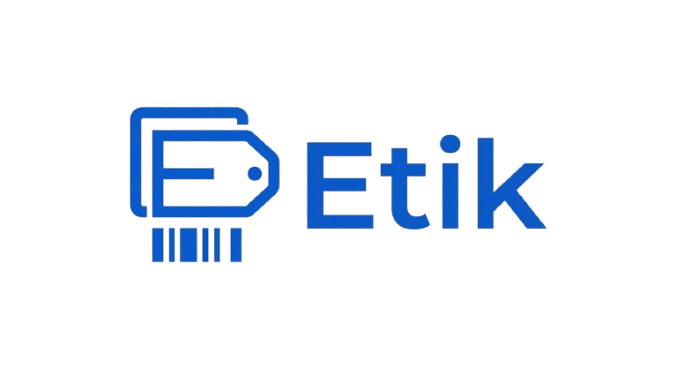

<p align="center">
  
</p>

<h1 align="center">Etik</h1>

<p align="center">
  Diseñador visual de etiquetas para escritorio y móvil, preparado para crear, personalizar e imprimir etiquetas con medidas reales.
</p>

<p align="center">
  <a href="https://springi790.github.io/Etik/"><strong>Abrir Etik en GitHub Pages</strong></a>
</p>

## Funciones

- Texto editable con alineación, tamaño, estilo y fuentes personalizadas.
- Importación local de imágenes.
- Códigos QR generados localmente, sin CDN durante el uso.
- Códigos de barras Code 128.
- Movimiento, redimensionado, rotación, capas y centrado de elementos.
- Tamaño de etiqueta configurable en milímetros.
- Cuadrícula, ajuste automático y margen seguro.
- Interfaz móvil con paneles inferiores y controles táctiles.
- Guardado local e importación/exportación de diseños JSON.
- Plantilla de prueba y opción de reiniciar la etiqueta.
- Impresión directa desde el navegador.
- Menú de ayuda con instrucciones para Zebra y otras impresoras.
- Manifiesto de aplicación web con iconos propios de Etik.

## Uso local

Puedes servir el repositorio con cualquier servidor HTTP estático. Por ejemplo:

```bash
python -m http.server 8000
```

Después abre `http://localhost:8000`.

## Aplicación web

Etik incluye `manifest.webmanifest` e iconos de 192 × 192 y 512 × 512 px para que el navegador pueda usar la identidad visual del proyecto al agregar el sitio a la pantalla de inicio o mostrarlo como aplicación web compatible.

## GitHub Pages

El repositorio incluye un workflow para desplegar automáticamente la rama `main` en GitHub Pages.

**Sitio:** https://springi790.github.io/Etik/

---

Core development by [@springi790](https://github.com/springi790)  
UI/UX design assistance by GPT-5.6 Sol · OpenAI  
© 2026 Etik
